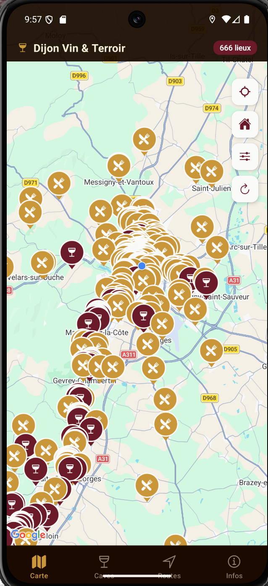
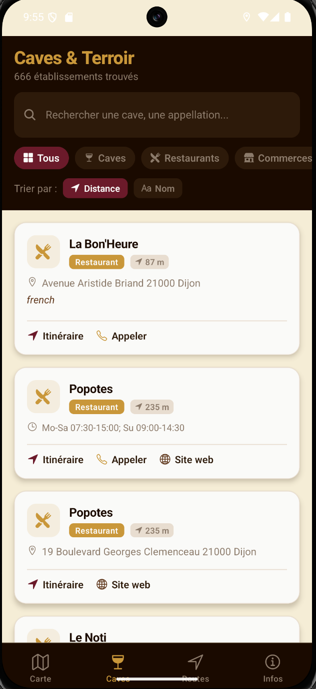
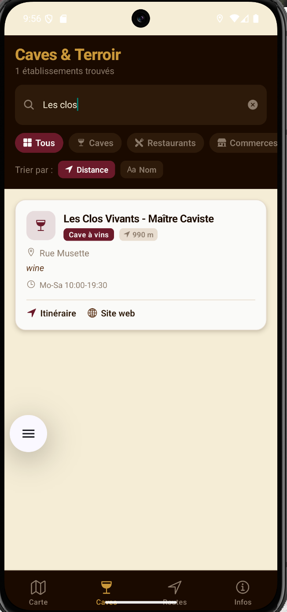
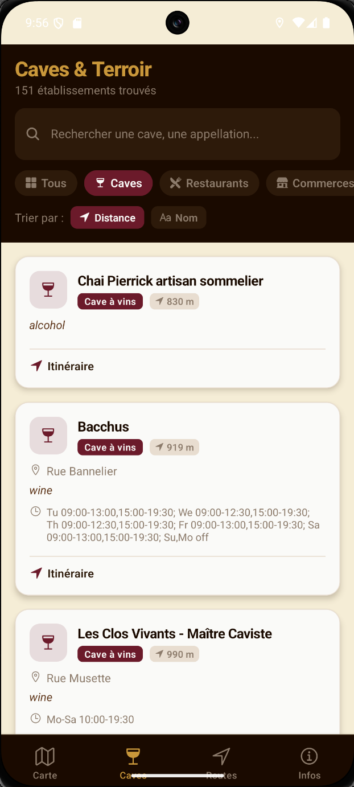
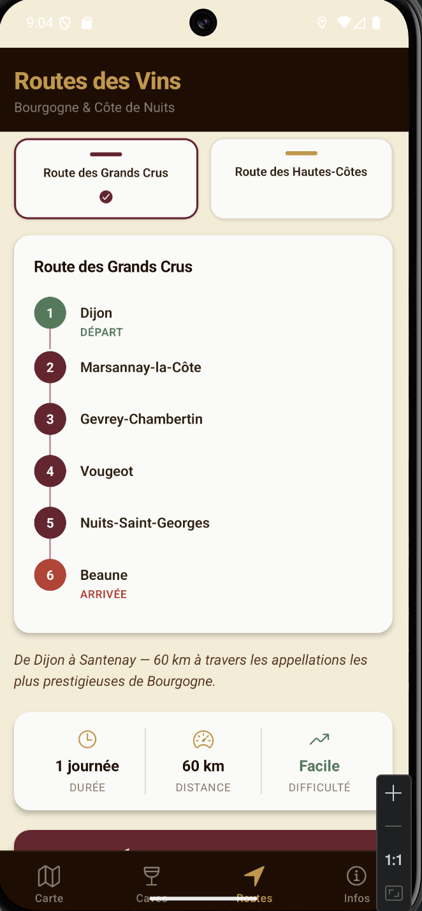
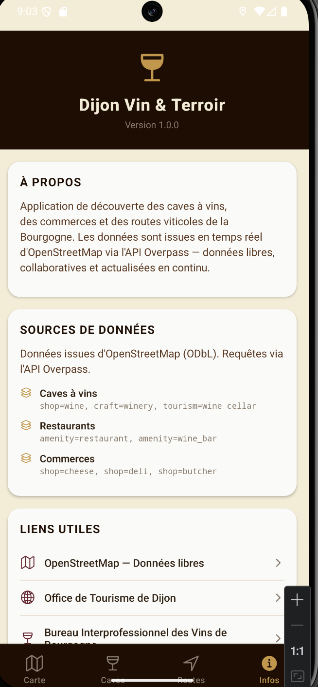

# Dijon Vin & Terroir — Geolocation App for Burgundy Wine Discovery


A native Android app built with React Native and Expo for discovering wine caves, restaurants, and gastronomic shops in the Dijon / Burgundy region of France. Data is pulled in real time from OpenStreetMap via the Overpass API — no mock data, no scraping.

---

## Demo

📱 [Descargar APK para Android](https://github.com/AdrianMalmierca/GeolocationDijonAPI/releases/latest)

> Enable **Unknown sources** in Settings → Security before installing.

---

## Screenshots
### Map screen
This is the main page where you can see the Map with the restaurants, commerces and caves.



### Detail screen
When you click on une marker in the map, you can see all the information about the restaurante, commerce or cave.


### List screen
You can see all the restaurants, commerces and caves in a list, which can be better to search



### Search screen
You can search a restaurante, commerce or cave by name



### Filter screen
If you press one filter, you will see only the establishments with that filter, in this case restaurant.



### Routes screen
Here you have a guide you can follow of the cities you can visit, with the time you need, the distance and the difficulty



### Info screen
Here you have some information about the app, where do I take the information and a small legend with the colours.



---

## Problem Statement

Burgundy is one of the world's most prestigious wine regions, yet there is no dedicated mobile tool for discovering its local caves, domaines, and gastronomic addresses in one place. Tourists and wine enthusiasts visiting Dijon either rely on generic map apps or outdated paper guides.

Dijon Vin & Terroir solves this by providing:
- A curated, map-based view of wine caves, restaurants, and local shops across the Dijon Métropole area
- Real-time data from OpenStreetMap — always up to date, no curation required
- Pre-built wine route itineraries (Route des Grands Crus, Route des Hautes-Côtes)
- Direct navigation, call, and website actions from every listing

---

## Features

### Carte (Map)
- Interactive native map centered on Dijon, covering the full Côte de Nuits / Côte de Beaune corridor
- Custom color-coded markers by category: caves (burgundy), restaurants (gold), shops (brown)
- Tap any marker to open a detail bottom sheet with full info and action buttons
- Filter overlay to toggle categories on/off
- "Centre sur Dijon" button to reset the view

### Caves & Terroir (List)
- Full scrollable list of all loaded establishments
- Full-text search across name, address and description
- Filter tabs by category: Tous / Caves / Restaurants / Commerces
- Sort by distance from user or alphabetically
- Pull-to-refresh to reload live data from Overpass API

### Routes des Vins
- Two pre-built itineraries with interactive waypoint timelines:
  - **Route des Grands Crus** — Dijon → Beaune, 60 km, 6 stops
  - **Route des Hautes-Côtes** — Nuits-Saint-Georges → Meuilley, 35 km, 3 stops
- Duration, distance, and difficulty per route
- "Démarrer dans Maps" button opens the itinerary in Google Maps / Apple Maps

### Infos
- Data source attribution (OpenStreetMap / Overpass API)
- Category legend
- Links to Office de Tourisme de Dijon, BIVB, and Routes des Vins de Bourgogne

---

## Tech Stack

| Layer | Technology | Reason |
|-------|-----------|--------|
| Framework | React Native + Expo SDK 55 | Cross-platform native app with managed workflow |
| Language | TypeScript | Type safety across hooks, services, and components |
| Navigation | React Navigation v6 (Bottom Tabs) | Native tab navigation with custom dark theme |
| Maps | react-native-maps | Native MapView with custom markers and bottom sheet |
| Location | expo-location | Foreground permission request and GPS coordinates |
| Data | OpenStreetMap via Overpass API | Free, open, always up-to-date POI data |
| HTTP | axios | Request handling with timeout and multi-server fallback |
| Build | EAS Build (Expo Application Services) | Cloud APK build without local Android SDK |

---

## Project Structure

```
DijonVin/
├── App.tsx                          #Entry point + bottom tab navigator
├── app.json                         #Expo config (permissions, icons, package name)
├── eas.json                         #EAS Build profiles (preview APK)
│
└── src/
    ├── constants/
    │   └── index.ts                 #Colors (Bourgogne palette), API config, mock fallback
    │
    ├── types/
    │   └── index.ts                 #Cave, RouteVin, FilterState, UserLocation interfaces
    │
    ├── services/
    │   ├── dijonApi.ts              #Overpass API queries, normalization, distance utils
    │   └── placesCache.ts           #Global singleton cache — loads data once, shared across all screens
    │
    ├── hooks/
    │   ├── useLocation.ts           #GPS permission + position with Dijon fallback
    │   └── usePlaces.ts             #Data loading, filtering, and state management
    │
    ├── components/
    │   ├── CaveCard.tsx             #Full listing card with call / navigate / website actions
    │   └── LoadingScreen.tsx        #Animated loading screen
    │
    └── screens/
        ├── MapScreen.tsx            #Interactive map with markers and bottom sheet
        ├── ListScreen.tsx           #Searchable, filterable list with sort
        ├── RoutesScreen.tsx         #Wine route itineraries with waypoint timeline
        └── AboutScreen.tsx          #Data sources, legend, and external links
```

---

## Data Source

All POI data comes from **OpenStreetMap** via the **Overpass API** — no authentication required.

**Bounding box:** `47.00,4.82,47.45,5.15` (Dijon + Côte de Nuits + Côte de Beaune)

**Queried tags:**

| Category | OSM Tags |
|----------|----------|
| Caves à vins | `shop=wine`, `shop=alcohol`, `craft=winery`, `tourism=wine_cellar` |
| Restaurants | `amenity=restaurant`, `amenity=wine_bar` |
| Commerces | `shop=cheese`, `shop=deli`, `shop=butcher`, `shop=bakery`, `tourism=attraction` |

Requests are sent to multiple Overpass servers in sequence (`overpass-api.de`, `overpass.kumi.systems`) — if the first server times out or returns empty, the next is tried automatically. If all servers fail, a curated mock dataset of 6 historic Burgundy estates is shown as fallback.

---

## Running Locally

**You dont need do all of this cause you can upload the apk directly as I exaplined at the beginning of this document**

```bash
# Clone the repository
git clone https://github.com/AdrianMalmierca/GeolocationDijonAPI.git
cd GeolocationDijonAPI

# Install dependencies
npm install

# Install missing peer dependencies
npx expo install expo-font

# Check for version mismatches
npx expo-doctor

# Start the development server
npx expo start --clear
```

Scan the QR code with **Expo Go** (Android) or the Camera app (iOS).

> ⚠️ The map screen (`react-native-maps`) requires a native build — it will not render in Expo Go. Use EAS Build to get the full experience.

### Building the APK

```bash
#Install EAS CLI
npm install -g eas-cli

#Login to your Expo account
eas login

#Configure the project (first time only)
eas build:configure

#Build a preview APK for Android
eas build -p android --profile preview
```

EAS builds in the cloud — no Android Studio required. Once complete, scan the QR code from the build page to install the APK directly on your device.

---

## Architecture Decisions

### Always Fetch Dijon, Not the User
The app always fetches data centered on Dijon (`47.32, 5.04`), regardless of the user's actual location. This ensures the app always has content to show — even when used from Spain or anywhere outside France. If the user's GPS coordinates are available, distances are calculated client-side using the Haversine formula and used for sorting only.

### Multi-Server Overpass Fallback
Overpass API public servers occasionally time out or return empty responses under load. Rather than failing silently to mock data, the service iterates through a list of known public Overpass mirrors and returns the first successful non-empty response. Timeout is set to 20 seconds per server.

### Custom Markers Without SVG
Map markers are built entirely with React Native `View` and `StyleSheet` — no SVG, no image assets. A circular bubble with a category icon sits on top of a CSS triangle tail, colored by category. This keeps the bundle small and markers sharp at any screen density.

### useCallback + Empty Dependency Array
`loadPlaces` in `usePlaces` is wrapped in `useCallback` with an empty dependency array, and the `useEffect` that calls it also uses `[]`. This ensures data loads exactly once when the screen mounts — not on every location update — which was the root cause of inconsistent results between the map and list screens.

---

## API Routes (Overpass)

| Query | Endpoint | Description |
|-------|----------|-------------|
| Caves | `overpass-api.de/api/interpreter` |`shop=wine`, `shop=alcohol`, `craft=winery`, `tourism=wine_cellar` |
| Restaurants | `overpass-api.de/api/interpreter` | `amenity=restaurant`, `amenity=wine_bar` |
| Commerces | `overpass-api.de/api/interpreter` | `shop=cheese`, `shop=deli`, `shop=butcher`, `shop=bakery`, `tourism=attraction` |

---

## Future Improvements

### Short Term
- **Offline mode** — cache last successful API response with AsyncStorage
- **Favourites** — save and persist favourite caves locally
- **Detail screen** — full-screen modal with opening hours, appellation tags, and map pin
- **Share** — deep link to a specific cave listing

### Medium Term
- **Route planner** — custom multi-stop itinerary builder with export to GPX

### Long Term
- **iOS build** — Apple Developer account + TestFlight distribution
- **User reviews** — lightweight rating system with local storage or Supabase backend
- **AR layer** — ARKit/ARCore overlay showing cave names when pointing the camera
- **BIVB integration** — official Bureau Interprofessionnel des Vins de Bourgogne data feed

---

## What I Learned Building This

### React Native Native Modules
The biggest technical challenge was `react-native-maps` — a native module that behaves differently depending on the build environment. It works in EAS builds but crashes in Expo Go, and requires a Google Maps API key on Android with `PROVIDER_GOOGLE`. It taught me to treat native modules as inherently unreliable and always provide a JavaScript fallback.

### Overpass API Query Language (ODSQL)
OpenStreetMap's Overpass query language has its own syntax and quirks — bounding box filters, tag matching with regex (`name~"vin|cave",i`), and the difference between `node`, `way`, and `relation` elements. Getting consistent results across multiple public servers required understanding how Overpass caches responses and why the same query can return different element counts on different servers.

### EAS Build and Keystore Management
Building a real APK with EAS introduced me to Android signing — keystores, SHA-1 fingerprints, and Google Cloud API key restrictions. The process of restricting a Maps API key to a specific package name and SHA-1 is straightforward but not well documented for EAS-managed keystores specifically.

### Expo SDK Version Alignment
Working with Expo's managed workflow means every native dependency must match the SDK version exactly. `react-native-maps 1.26` vs `1.27` caused a crash that took time to diagnose. Running `npx expo-doctor` and `npx expo install --check` became a routine step after any dependency change.

### GPS Fallback Strategy
Handling location permissions gracefully on Android requires thinking through all failure modes: permission denied, location services disabled, GPS timeout, and the app being used from a different country entirely. The fallback to Dijon's coordinates ensures the app is always useful, even without location access.

---

## License

MIT — free to use, modify, and deploy.

---

## Author

**Adrián Martín Malmierca**  
Computer Engineer & Mobile Applications Master's Student  
[GitHub](https://github.com/AdrianMalmierca) · [LinkedIn](https://www.linkedin.com/in/adri%C3%A1n-mart%C3%ADn-malmierca-4aa6b0293/)

*Built as a portfolio project targeting the French tech market — ESNs and consulting firms in Burgundy/Dijon.*
